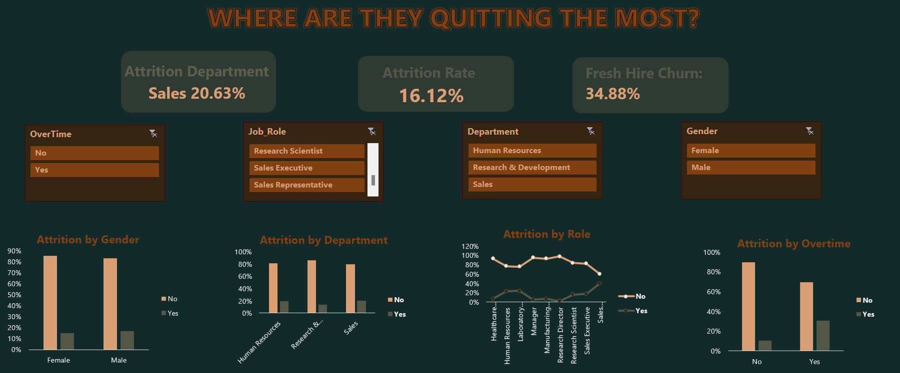

# The Exit Equation: Employee Attrition (Excel Dashboard)
 > Self-initiated project to practice HR analytics and Excel dashboarding skills.

## TL;DR
**Problem**: **16% of employees were leaving,** driving up costs and operational risks; the reasons were unclear.

**Process**: Analyzed **1,470 employees in Excel,** segmenting by department, role, tenure, satisfaction, and workload to uncover churn patterns.

**Result**: 
 * **High-risk areas**: Sales (**20.63% attrition**), employees with overtime (**30.53%**)
 * **Key drivers**: Low work-life balance, poor job satisfaction, lower income bands, fresh hires
 * **Actionable takeaway**: Implement targeted onboarding, compensation adjustments, burnout prevention, and role support expected to reduce early exits.

## Dashboard Preview
This **Excel dashboard** highlights: 
* **Churn by department**
* **High-risk job roles**
* **Employee satisfaction patterns**

Interactive charts allow HR to **instantly spot trends and high-risk groups,** turning insights into action.

## Table of Contents
 - [Overview](#Overview)
 - [Key Questions Answered](#key-questions-answered)
 - [KPIs Tracked](#kpis-tracked)
 - [Business Insights & Strategic Recommendations](#business-insights--strategic-recommendations)
 - [Tools Used](#tools-used)
 - [Case Study: Behind the Queries](#case-study-behind-the-queries)
 - [What I'd Explore Next](#what-id-explore-next)
 - [What This Project Demonstrates](#what-this-project-demonstrates)
 - [Let's Connect](#lets-connect)

## Overview
This analysis leverages a **synthetic HR dataset of 1,470 employees** to uncover the **key drivers of attrition** across departments, roles, and demographics. Using **Excel-based modeling,** it turns raw HR data into **actionable insights** that help HR teams **spot trends, reduce turnover, and make smarter strategic decisions.**

## Key Questions Answered 
 * Which departments and roles experience the **highest attrition**?
 * Are there **demographic or workload patterns** linked to exits?
 * How do **satisfaction, income, and tenure** influence turnover?
 * Which employee cohorts are at **greatest risk of leaving**?

## KPIs Tracked
 * **Total Attrition Rate**: 16.12%
 * **Fresh Hire Attrition (0-1 year)**: 34.88%
 * **Highest Attrition Department**: Sales (20.63%)
 * **Highest Attrition Role**: Sales Representative (39.76%) 

## Business Insights & Strategic Recommendations
## Departmental Trends
- **Sales:** 20.63% attrition
- **Human Resources:** 19.05% attrition

**Recommendation:** Audit job expectations and workloads in high-turnover departments to reduce exit risk.

## Role-Specific Breakdown
- **Sales Representatives:** 39.76% attrition (≈4x company average)
- **Research Directors:** 2.5% attrition

**Observation:** Entry-level or quota-driven roles may need better support systems or incentive realignment.

## Gender-Based Patterns
Male attrition: **17.01%** | Female attrition: **14.80%**

Recommendation: Examine role distribution and promotion equity to investigate whether inequities in promotions or role allocation are driving gender differences.

## Overtime & Burnout
- **Overtime employees:** **30.53%** attrition vs **10.44%** for others

 **Recommendation:** Monitor overtime and implement burnout prevention in high-pressure roles.

## Compensation & Retention 
- **Lower-income employees:** **28.61%** attrition

**Recommendation:** Strengthen pay transparency and progression frameworks.

## Tenure & Retention 
- **Fresh hires (0-1 yrs):** **34.88%** attrition vs **12.91%** for 5+ year employees.

**Recommendation:** Prioritize onboarding quality and engagement touchpoints in the first 6 months.

## Satisfaction Metrics
- **Work-Life Balance:** 31.25% attrition
- **Job Satisfaction:** 22.84% attrition

**Recommendation:** Use pulse surveys to detect early dissatisfaction and implement proactive interventions.

## Tools Used
**Microsoft Excel** - Data cleaning, pivot tables, KPI tracking, and dashboard design.
  
## Case Study (Full Walkthrough)
For a deeper look at the analysis logic, segmentation methodology, and strategic recommendations, explore the full HR case study below:
👉[View the full case study](https://docs.google.com/document/d/1UvtNh63Pqlk9doOYvelR3UggBd_6P2AbMk_uvuq11EQ/edit?usp=sharing)

## What I'd Explore Next
As a next step to deepen this analysis:
 * Add **exit interview data** to capture *qualitative* reasons for leaving
 * Explore **time-based patterns** in attrition (e.g., seasonality, post-promotion exits)
 * Integrate **employee engagement survey results** to enrich predictive signals.

## What This Project Demonstrates
 - Ability to translate HR data into actionable business insights
 - Experience building clear, functional dashboards in **Excel**
 - Understanding of attrition metrics and their business impact
 - Exposure to the full analysis cycle - from data cleaning to stakeholder-ready presentation

## Let's Connect
I'm building my career in data and HR analytics with a focus on understanding workplace dynamics through HR data. Feel free to reach out via:
* [GitHub](https://github.com/Shrey0561)
* [LinkedIn](https://www.linkedin.com/in/shreya-srinath-879a66205/)
* [Notion](https://www.notion.so/Data-Analyst-Portfolio-221ebe151fdd801e9445e32590b67758?source=copy_link)

I'm always up for conversations, mentorship, or entry-level opportunities.

